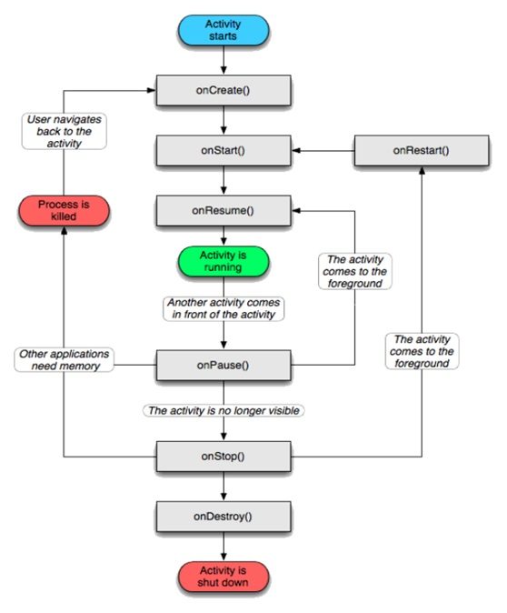
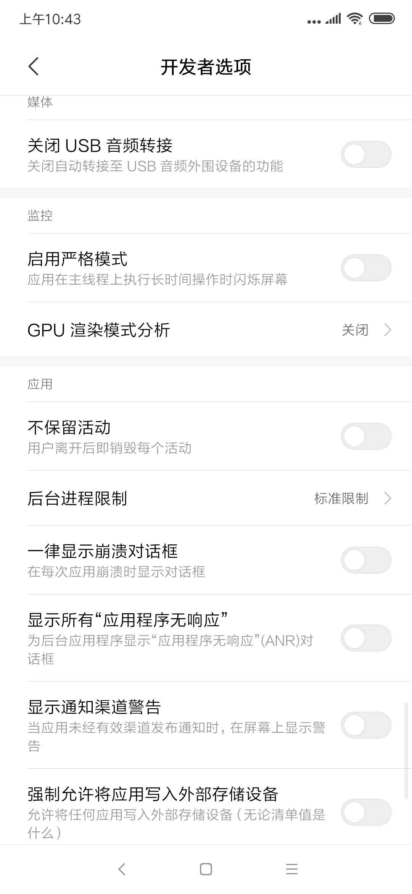
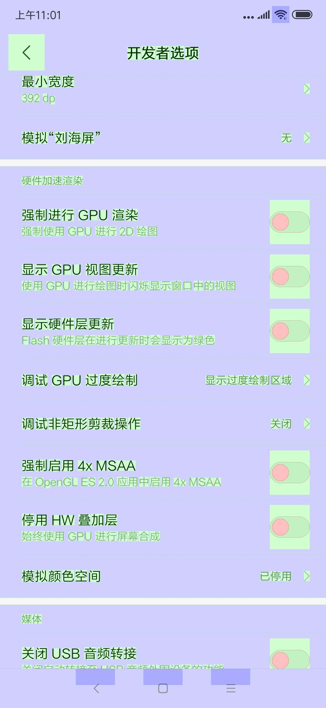

# ANDROID四大组件入门

## ACTIVITY
 
在android的应用中，你所看到的界面都是附着在activity上去呈现的。可以这么认为一个activity就是一个页面。我们的app由很多个activity组成，activity互相调用就形成了页面的互相跳转。但是我们的手机毕竟还是属于嵌入式设备，设备里所有的资源都是非常宝贵的，系统会时不时的在资源紧张的时候腾出尽可能多的空间来供后面人使用，这就带来一个问题——你的app可能会在某一刻被操作系统杀死。作为开发者，这样的要求未免太苛刻一点，我们在正常处理业务的同时还得担心自己会被清理掉。为了解决这个问题，在android操作系统里，我们引进了activity生命周期这个概念，系统在处理资源的时候，会对应的调用这些生命周期。因此上层开发者只需要在对应的生命周期里做正确的事就可以了。比如在页面销毁的时候做资源清理工作。其实不光是acitivity，android系统里几乎所有的组件都是有生命周期的。




- onCreate <br>
    当活动第一次启动的时候，触发该方法，可以在此时完成活动的初始化工作。 
onCreate 方法有一个参数，该参数可以为空（ null ），也可以是之前调用 onSaveInstanceState （）方法保存的状态信息。

- onStart <br>
该方法的触发表示所属活动将被展现给用户。

- onResume <br>
当一个活动和用户发生交互的时候，触发该方法。

- onPause <br>
当一个正在前台运行的活动因为其他的活动需要前台运行而转入后台运行的时候，触发该方法。这时候需要将活动的状态持久化，比如正在编辑的数据库记录等。

- onStop <br>
当一个活动不再需要展示给用户的时候，触发该方法。如果内存紧张，系统会直接结束这个活动，而不会触发 onStop 方法。 所以保存状态信息是应该在onPause时做，而不是onStop时做。活动如果没有在前台运行，都将被停止或者Linux管理进程为了给新的活动预留足够的存储空间而随时结束这些活动。因此对于开发者来说，在设计应用程序的时候，必须时刻牢记这一原则。在一些情况下，onPause方法或许是活动触发的最后的方法，因此开发者需要在这个时候保存需要保存的信息。

- onRestart <br> 
当处于停止状态的活动需要再次展现给用户的时候，触发该方法。

- onDestroy <br> 
当活动销毁的时候，触发该方法。和 onStop 方法一样，如果内存紧张，系统会直接结束这个活动而不会触发该方法。

- onSaveInstanceState <br> 
系统调用该方法，允许活动保存之前的状态，比如说在一串字符串中的光标所处的位置等。 
通常情况下，开发者不需要重写覆盖该方法，在默认的实现中，已经提供了自动保存活动所涉及到的用户界面组件的所有状态信息。

所以如果我们作为QA除了关注软件行为正常之外还应该关注什么？
前面提到操作系统会不定时的回收资源，所以我们作为QA最需要关心的就是内存回收。

考虑这个场景，一个用户在旅游app里下单，订单填写了一大部分，但是这时候微信弹出消息，用户切换app到微信里回复。不巧的是这时候资源紧张，系统回收了一部分。当用户重新切换到旅游app时，需要对页面重新渲染。但是因为发生了内存回收，因此渲染方式稍稍有些不同。

懒惰的程序员会什么都不做，这时候界面一片空白，我之前填写的内容全部消失了，用户肯定会觉得很困惑，甚至恼羞成怒的指责软件开发人员。严谨的程序员会小心的处理这些场景，比如在onSaveInstanceState方法里保存上下文，并且会在之后页面重新响应的时候恢复这些上下文。但也有中庸的程序员，我保证大部分场景不崩溃就行了，需要严格保存上下文的地方我会去处理的。

因而当发生内存回收时，我们作为QA需要关注软件行为有没有达到我们预想的目标。如何模拟？

勾选 *设置 -> 开发者选项 -> 不保留活动* 



### More?

1. 渲染效率
很少有人去关心渲染效率，直到发生问题的时候，那么我们怎么去发现呢？


2. debug 神器 *adb*

通过脚本命令安装
```shell
brew cask install android-platform-tools
```

在手机打开开发者模式后输入
```shell
adb devices
```
可以看到链接的设备。

我推送文件到手机上
```shell
adb push <your file> /sdcard/
```

我从手机上拷出文件
```shell
adb pull <your file> <pc上的文件路径>
```

我发现这个页面奔溃了，但我更想让程序员知道哪个页面出了问题
```shell
adb shell dumpsys activity top | grep ACTIVITY
```

运行结果
```
~ adb shell dumpsys activity top | grep ACTIVITY
  
  ACTIVITY com.shanbay.words/.startup.SplashActivity 19094de7 pid=11358
```

## SERVICE

service可以在和多场合的应用中使用，比如播放多媒体的时候用户启动了其他Activity这个时候程序要在后台继续播放，比如检测SD卡上文件的变化，再或者在后台记录你地理信息位置的改变等等，总之服务嘛，总是藏在后头的。

service是在一段不定的时间运行在后台，不和用户交互应用组件。每个Service必须在manifest中 通过service标签来声明。可以通过context.startservice和context.bindserverice来启动。

service和其他的应用组件一样，运行在进程的主线程中。这就是说如果service需要很多耗时或者阻塞的操作，需要在其子线程中实现。
service有两种启动模式（startService()/bindService()）

如何选用启动方式完全由你的需求觉得，如果你期望我发布了一个任务后就不管了，那么直接用startService就可以，但是如果你希望跟serivce有一些交互，我指的是调用service提供的api，那就选用bindService，但是要注意不用的时候要调用unbindService，如果没有调用，那么可能导致资源泄露。不过我们可以从log里找到信息，可以通过adb命令去查找这些信息

```
adb logcat | grep leaked
```

如果有类似的log出来，说明就发生了泄露。

同样service也有自己的生命周期，但又因为service不可见，所以我们从直觉上就可以感觉到，如果我去设计操作系统，当内存紧张的时候我肯定先去回收那些用户不可见的资源。因而service比activity更容易被回收掉。

一些额外的事，既然service这么脆弱，那它还有没有其他的优点？

当然有，service在创建的时候可以指定进程名（其实activity也可以，甚至从android源码来看，service和activity除了一个没有界面一个有界面外并没有其它区别），这就可以让我们把业务拆成微小的服务，服务奔溃了因为在另外一个进程里，因而可以保证我的主进程（用户看到的界面那个进程）稳定，同时给予服务重启的机会，我下次连接服务的时候就可以重启。

如何查看服务？

运行命令
```shell
adb shell dumpsys activity | grep com.shanbay.words | grep ServiceRecord
```

结果
```
~ adb shell dumpsys activity | grep com.shanbay.words | grep ServiceRecord
  * ServiceRecord{8b32ac1 u0 com.shanbay.words/com.xiaomi.mipush.sdk.MessageHandleService}
  * ServiceRecord{3bea469a u0 com.shanbay.words/com.xiaomi.mipush.sdk.PushMessageHandler}
  * ServiceRecord{4b84a65 u0 com.shanbay.words/com.xiaomi.push.service.XMPushService}
  * ServiceRecord{2f6f283e u0 com.shanbay.words/com.shanbay.tools.logger.trace.LogService}
  * ServiceRecord{195f2bcb u0 com.shanbay.words/com.shanbay.tools.media.compat.CompatCheckService}
```

## Broadcast Receiver

广播分为两种：

- 正常广播 <br>
Normal broadcasts（用 Context.sendBroadcast()发送）是完全异步的。它们都运行在一个未定义的顺序，通常是在同一时间。这样会更有效，但意味着receiver不能包含所要使用的结果或中止的API。

- 有序广播 <br>
Ordered broadcasts（用 Context.sendOrderedBroadcast()发送）每次被发送到一个receiver。所谓有序，就是每个receiver执行后可以传播到下一个receiver，也可以完全中止传播--不传播给其他receiver。 而receiver运行的顺序可以通过指定priority来控制，当priority优先级相同的时候，Receiver以任意的顺序运行。

和所有的android组件一样，广播也可以通过注册的方式声明，也可以通过运行时java代码进行声明注册。

java代码运行时注册的话需要调用registerReceiver同样，在不用的时候需要调用unregisterReceiver，否则将会发生泄露，可以通过adb命令去查找这些信息

```
adb logcat | grep leaked
```

如果有类似的log出来，说明就发生了泄露。

我理解的 Broadcast Receiver 应用场景就在于基于消息模型的场景。我不知道当一个事件发生时关注的人有哪些，我只是简单的发布消息就行了，关心的人自己去处理。

## Content Provider

ContentProvider（内容提供者）是Android中的四大组件之一。主要用于对外共享数据，也就是通过ContentProvider把应用中的数据共享给其他应用访问，其他应用可以通过ContentProvider对指定应用中的数据进行操作。ContentProvider分为系统的和自定义的，系统的也就是例如联系人，图片等数据。

android中对数据操作包含有：file, sqlite3, Preferences, ContectResolver与ContentProvider前三种数据操作方式都只是针对本应用内数据，程序不能通过这三种方法去操作别的应用内的数据。

android中提供ContectResolver与ContentProvider来操作别的应用程序的数据。
使用方式:
- 一个应用实现ContentProvider来提供内容给别的应用来操作，
- 一个应用通过ContentResolver来操作别的应用数据，当然在自己的应用中也可以。

以下这段是Google Doc中对ContentProvider的大致概述:

内容提供者将一些特定的应用程序数据供给其它应用程序使用。内容提供者继承于ContentProvider 基类，为其它应用程序取用和存储它管理的数据实现了一套标准方法。然而，应用程序并不直接调用这些方法，而是使用一个 ContentResolver 对象，调用它的方法作为替代。ContentResolver可以与任意内容提供者进行会话，与其合作来对所有相关交互通讯进行管理。

配合ContentProvider，我们可以很方便的访问其他应用，或者其他业务的数据。


## Other

关注官网 [android developer](https://developer.android.com/)
